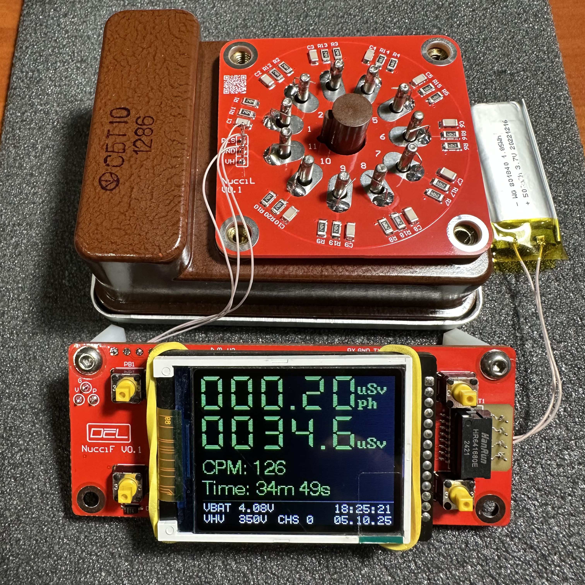
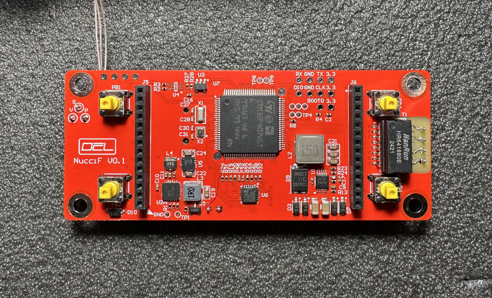
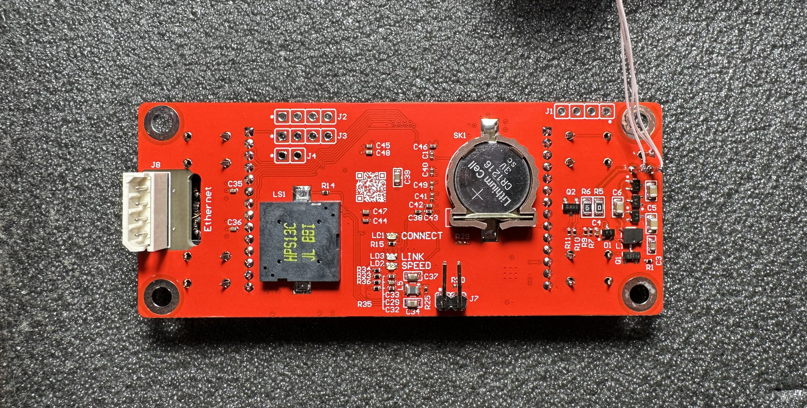
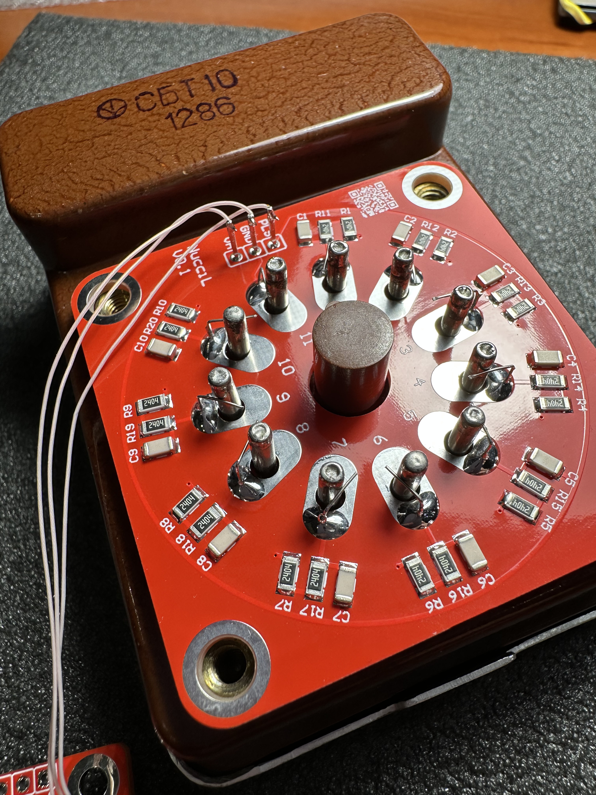

# Nucci -- NUClear Counter Interface

## Overview

- IPS 160x128 pixel front panel display
- 10/100BASE-T Ethernet
- Modbus TCP for remote programming
- Web interface for monitoring

## Specifications and features

Current consumption from a 3.7V battery is 0.142A (3.408Ah per twenty-four hours) with the backlight on, 0.114A (2.736Ah per twenty-four hours) with the backlight off.

The detector tube voltage is set from the menu in the range of 100-450V.

## Hardware

Assembly:

PCB top:

PCB bottom:

SBT10 connector:

